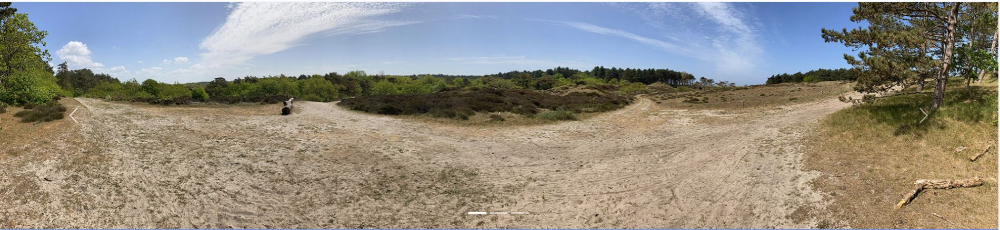

# North Holland Dunes

This site is intended to give a first impression of the beauty of the North-Holland dunes and to encourage you to explore the very diverse hiking routes and perhaps even book a guide for a guided walk with more information.

## Features

### Existing features

- __Navigation Bar__
  - The navigation bar contains links to all five sections of the site: the logo leads to the Landing page image section, the other links respectively to the About section, Explore section, Impressions section and Contact section.
  - This section will allow the user to easily navigate from section to section across all devices.
  - The navigation bar is fully responsive. On smaller devices, the hamburger menu appears with an exmanded menu bar.

- __Landing page image__
  - The landing includes a photograph with text overlay that shows the goal of the whole website "Dunes in North-Holland Explore the beauty" and to allow the user to jump to the explore section with a button.
  - This section introduces the user to Dunes in North-Holland with an eye catching animation to grab their attention.

- __About section__
  - The About section briefly introduces the user to the nature of the North Holland dunes.
  - It also explains that you need a ticket to enter.

- __Explore section__
  - The Explore section shows the user the different locations of the North Holland dunes.
  - In addition, the various hiking routes can be viewed here by clicking on the button.

- __Impressions section__
  - The impressions section shows three panorama pictures with a slider to show the user the beauty once again.
  - The user can control the slides himself with the navigation elements or watch the slides change automatically.

- __Contact section__
  - The Contact section allows the user to get in touch with us, ask questions or book a hiking route with a guide.
  - The user will be asked to submit their first and last name, an email address and a message.
  - The user must agree to the Privacy Policy.

- __Footer section__
  - The footer section includes a link to the relevant social media site on instagram. More photos of the beauty of the dunes should be shown there and exchanged or linked among each other. The links will open to a new tab to allow easy navigation for the user.
  - The footer is valuable to the user as it encourages them to keep connected via social media.
  - The footer also contains a link to the Privacy Policy. There, users can read the privacy policy.
  - The footer also contains a copyright.

- __Privacy Policy__
  - The privacy policy page includes an overview of data protection, hosting, general information and mandatory information, recording of data on this website and the used tools.

- __Nav bar on Privacy Policy page__
  - The nav bar on the Privacy Policy page only contains the logo and a "back to home" link to navigate back to the main page.
  - The nav bar is fully responsive.

- __Footer on Privacy Policy page__
  - The footer section includes a link to the relevant social media site on instagram. More photos of the beauty of the dunes should be shown there and exchanged or linked among each other. The links will open to a new tab to allow easy navigation for the user.
  - The footer is valuable to the user as it encourages them to keep connected via social media.
  - The footer doesn`t contain the link to the Privacy Policy.
  - The footer also contains a copyright.

### Features Left to Implement

- Currently, no Hiking Routes appear when you click on the Hiking Routes button.
- The contact form does not send any requests yet.

## Testing
